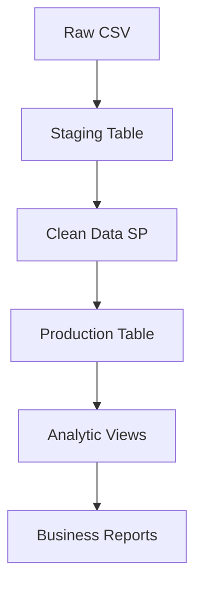

# Tembo Hotel Data Pipeline

A comprehensive PostgreSQL data pipeline for hotel booking analytics, built with stored procedures and automated ETL processes.

## Overview

This project transforms raw, dirty hotel booking data into clean, analyzable datasets using:
- **Stored Procedures** for data cleaning and validation
- **Automated ETL** pipeline with error handling
- **Analytic Views** for business intelligence
- **Performance Indexes** for query optimization

## Project Structure

```
tembo-hotel/
├── dataset/
│   └── tembo_hotel_dirty.csv          # Raw booking data
├── sql/
│   ├── ddl/                           # Database schema definitions
│   │   ├── 01_schema_and_staging.sql  # Schema and staging table
│   │   ├── 02_production_table.sql    # Production table with constraints
│   │   └── 03_indexes.sql             # Performance indexes
│   ├── procedures/                    # Stored procedures
│   │   ├── 01_clean_booking_data.sql  # Data cleaning logic
│   │   └── 02_load_production_data.sql # Production data loading
│   └── views/                         # Analytic views
│       └── 01_analytic_views.sql      # Business intelligence views
├── scripts/
│   ├── etl_pipeline.sql               # Master ETL orchestration
│   └── load_csv.py                    # CSV loading script
├── docs/
│   ├── data_audit.md                  # Data quality assessment
│   └── api_reference.md               # View and procedure documentation
└── README.md                          # This file
```

## Quick Start

### Prerequisites
- Python 3.8+
- PostgreSQL (Neon recommended)
- Required Python packages: `pandas`, `psycopg2`

### Setup Steps

1. **Clone and navigate to project**
   ```bash
   cd tembo-hotel
   ```

2. **Set up Neon database**
   - Create a new project at [console.neon.tech](https://console.neon.tech)
   - Copy the connection string

3. **Configure environment**
   ```bash
   export DATABASE_URL="your_neon_connection_string"
   ```

4. **Run the ETL pipeline**
   ```bash
   # Load CSV data
   python scripts/load_csv.py

   # Run ETL pipeline (connect to database first)
   psql "$DATABASE_URL" -f scripts/etl_pipeline.sql
   ```

## Data Pipeline Flow



### Stage 1: Data Ingestion
- Raw CSV loaded into `bookings_staging` table
- All columns stored as TEXT to handle dirty data

### Stage 2: Data Cleaning
- **Stored Procedure**: `clean_booking_data()`
- Handles: name casing, phone formatting, date standardization, category normalization
- Removes duplicates and invalid records

### Stage 3: Production Load
- **Stored Procedure**: `load_production_data()`
- Type casting and validation
- Loads clean data into `bookings` table

### Stage 4: Analytics
- **Views**: `v_clean_bookings`, `v_monthly_revenue`, `v_room_performance`, etc.
- **Indexes**: Optimized for common query patterns

## Key Features

### 🔧 Stored Procedures
- `clean_booking_data()`: Comprehensive data cleaning
- `load_production_data()`: Production data loading with validation

### 📊 Analytic Views
- `v_clean_bookings`: Core cleaned dataset with calculated fields
- `v_monthly_revenue`: Time-series revenue analysis
- `v_room_performance`: Room type profitability metrics
- `v_staff_performance`: Employee performance rankings
- `v_guest_insights`: Guest behavior by location
- `v_cancellation_analysis`: Booking cancellation patterns

### 🚀 Performance Optimizations
- Strategic indexes on date, categorical, and composite columns
- Partial indexes for active bookings
- Query-optimized view definitions

## Data Quality Issues Addressed

| Issue Type | Examples | Solution |
|------------|----------|----------|
| Name casing | `ALICE MWANGI`, `alice mwangi` | `INITCAP(TRIM())` |
| Phone formats | `+254712345678`, `0712-345-678` | Regex normalization |
| Date formats | `05/01/2024`, `01-05-2024` | PostgreSQL date parsing |
| Categories | `standard`, `Std`, `DLX` | CASE standardization |
| Missing data | Empty strings, NULLs | COALESCE defaults |
| Duplicates | Exact booking duplicates | CTID-based deduplication |

## Usage Examples

### Revenue Analysis
```sql
SELECT * FROM v_monthly_revenue
WHERE month >= '2024-01'
ORDER BY total_revenue DESC;
```

### Room Performance
```sql
SELECT room_type, total_revenue, avg_rating
FROM v_room_performance
ORDER BY revenue_per_night DESC;
```

### Staff Rankings
```sql
SELECT staff_name, revenue_generated, revenue_rank
FROM v_staff_performance
WHERE revenue_rank <= 10;
```

## API Reference

See `docs/api_reference.md` for detailed documentation of all views, procedures, and their schemas.

## Data Audit

See `docs/data_audit.md` for the original data quality assessment and cleaning decisions.

## Contributing

1. Create a feature branch from `development`
2. Make changes with proper testing
3. Update documentation
4. Create pull request

## License

This project is for educational purposes. Data and structure inspired by real-world hotel management systems.